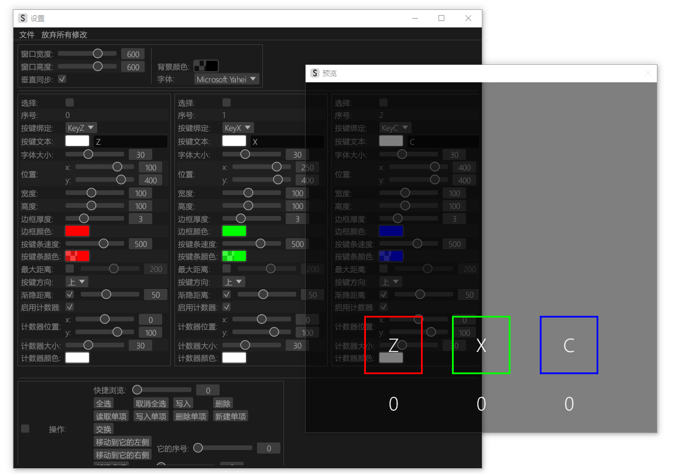

# 高性能KeyOverlay(HighPerformanceKeyOverlay)

这是一个致力于~~节省你的电费~~高性能的KeyOverlay项目，但不只有高性能。
一个可视化的编辑器足以成为你选择它的理由。

# FAQ

Q: 窗口背景不透明？

A: ~~window transparency on Windows sxxks~~

对于Nvidia显卡：在驱动页面中找到“管理3D设置”->“Vulkan/OpenGL现行方法”，将该选项设置为“优先本机”。

若执行上述方法后窗口仍为不透明，则可能是程序渲染后端回落到了OpenGL，目前程序仅在Vulkan后端下支持窗口透明。

窗口透明表现不影响[OBS](https://obsproject.com/)捕获。

# 未来计划

- [x] ~~native Vulkan backend~~ ~~no need for it~~ now we have native vulkan backend & transparent background
- [x] implement main_app without eframe+egui for extreme performance.